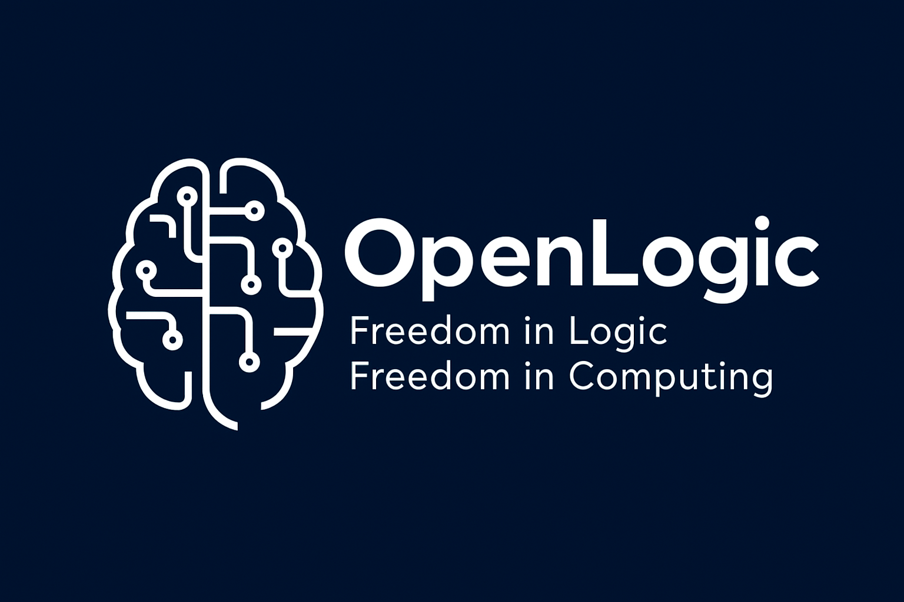

  

# UniversalApproximatorTheory
"Every Thing is Possible" — A unified theory connecting AI, mathematics, and philosophy to explain an infinite field of possibilities in reality.

# Universal Approximator Theory: Every Thing is Possible

## Technical Documentation and White Paper

**Version:** 1.0  
**Date:** November 11, 2025  
**Author:** Seyed HamidReza Reyhani  
**Affiliations:** Founder of OpenLogic, Creator of Universal Approximator Theory  
**License:** CC BY 4.0  
**GitHub Repository:** [https://github.com/HamidrezaReyhani](https://github.com/HamidrezaReyhani)

---

## Overview

**Universal Approximator Theory** — also known as **“Every Thing is Possible”** — proposes that all forms of existence, perception, and possibility are manifestations of an underlying *universal approximator function* that continuously generates, transforms, and redefines reality within an infinite space of potential outcomes.

The theory unites **mathematics**, **logic**, **artificial intelligence**, and **philosophy**, asserting that the same principle that allows neural networks to approximate any function also governs the universe itself:  
> **Existence is an infinite, self-evolving approximation of all that can possibly be.**

In short:  
> If an approximator can represent any possible function, and reality behaves as such an approximator, then by definition, **nothing is impossible**.

---

## Abstract

The **Universal Approximator Theory (UAT)** extends the concept of the *Universal Approximation Theorem* from artificial intelligence to a cosmological and logical scale. It treats the universe as a **dynamic computational field** where all possible states coexist probabilistically, and **consciousness** acts as a selective filter within this infinite function space.

The theory provides a mathematical and philosophical framework for modeling **reality as an emergent approximation of every possible existence**.

---

## Mathematical Framework

### 1. Universal Possibility Space

Let the total possibility space \( \Omega \) represent an infinite-dimensional vector space containing all potential states of existence:

\[
\Omega = \{ S_i \mid S_i \text{ is any conceivable or computable state} \}
\]

### 2. Existence as Approximation

At any given time \( t \), the observable universe \( E(t) \) is a **partial approximation** of the total possibility space:

\[
E(t) = f_\theta(\Omega, t) \approx \Omega
\]

where \( f_\theta \) denotes a parametric function (analogous to a neural network) continuously evolving toward a more complete representation of all possible states.

### 3. Probability Field of Realization

Each potential state \( S_i \) carries a realization probability \( P(S_i) \), such that:

\[
\sum_i P(S_i) = 1 \quad \text{and} \quad P(S_i) > 0 \; \forall S_i \in \Omega
\]

This ensures that **every possible thing** has a nonzero chance of being realized — hence, *every thing is possible.*

### 4. Consciousness as Selector

Let \( C \) denote a **consciousness operator** that acts as a projection or filter upon the total possibility space:

\[
R = C(\Omega) = \{ S_i \in \Omega \mid C(S_i) = 1 \}
\]

This describes perception or experience as the **selective realization of infinite potential** into finite observation.

---

## Philosophical Implications

| Dimension | Description |
|------------|--------------|
| **Ontological** | Existence is not fixed but a continuous approximation of all possible states. |
| **Epistemological** | Knowledge represents dynamic mappings within the infinite approximator. |
| **Metaphysical** | Impossibility is undefined; all potential states exist with nonzero probability. |

The theory suggests that the universe itself is *learning*, *adapting*, and *refining its approximation* of the infinite — making “reality” a self-correcting computational process.

---

## Applications

### 🧠 Artificial Intelligence
Provides a theoretical foundation for **universal learning systems** that asymptotically evolve toward total representational capacity — akin to an AI capable of approximating all possible structures of knowledge.

### ⚛️ Quantum Physics
Offers a bridge between **probabilistic quantum fields** and **information theory**, interpreting the quantum state as part of the universal possibility field \( \Omega \).

### 🧬 Philosophy of Mind
Models **consciousness** as a **selector function** operating on infinite informational space, defining subjective reality as a projection of possibility into perception.

### 🔢 Mathematics & Logic
Proposes an **extended interpretation** of the Universal Approximation Theorem into a logical-metaphysical domain, where approximation becomes a universal property of being itself.

---

## Core Postulates

1. **Nothing is impossible** — all conceivable states exist with nonzero probability.  
2. **Reality is computational** — existence functions as a continuous approximator of all possible forms.  
3. **Consciousness is selective** — perception collapses infinite potential into finite observation.  
4. **Truth is dynamic** — knowledge evolves through recursive approximation and re-evaluation.  

---

## Conceptual Summary

| Symbol | Meaning |
|:--:|:--|
| \( \Omega \) | Universal possibility space |
| \( S_i \) | Individual possible state |
| \( f_\theta \) | Parametric function approximating reality |
| \( C \) | Consciousness operator |
| \( E(t) \) | Observable universe at time *t* |
| \( P(S_i) \) | Realization probability of state \( S_i \) |

---

## Conclusion

The **Universal Approximator Theory** unifies computation, logic, and metaphysics under one principle:  
> **Reality itself is an infinite approximator of possibility.**

By recognizing existence as probabilistic, continuous, and ever-expanding, this framework establishes a foundation for a scientific and philosophical understanding of why — ultimately —  
> **Every Thing is Possible.**

---

## References

1. Hornik, K. (1991). *Approximation capabilities of multilayer feedforward networks.* Neural Networks.  
2. Tegmark, M. (2014). *Our Mathematical Universe.*  
3. Deutsch, D. (1997). *The Fabric of Reality.*  
4. Chaitin, G. J. (2006). *Meta Math: The Quest for Omega.*  
5. Shannon, C. E. (1948). *A Mathematical Theory of Communication.*

---

## OpenLogic Initiative

This project is part of the **OpenLogic** foundation — a research and development initiative founded by **Seyed HamidReza Reyhani**, dedicated to creating open theoretical frameworks that unify logic, mathematics, and reality modeling.

🔗 [OpenLogic on GitHub](https://github.com/HamidrezaReyhani)  
📄 Licensed under [Creative Commons BY 4.0](https://creativecommons.org/licenses/by/4.0/)

---

**© 2025 OpenLogic. All rights reserved.**
